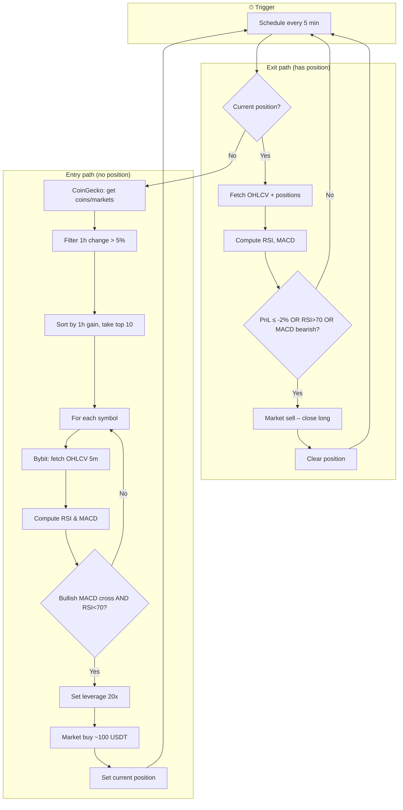
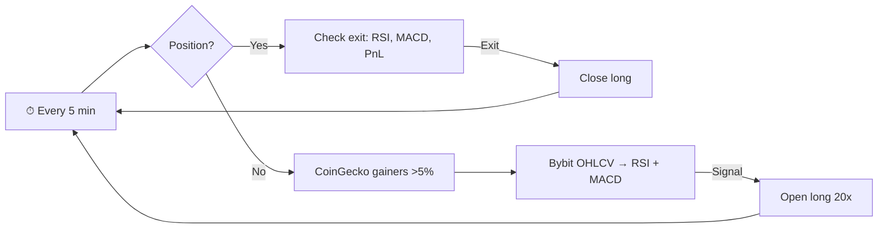

# Momentum Bot – Node / n8n Overview

Visual and node-based overview of the flow. Use the **Mermaid** diagram in any Markdown viewer (GitHub, VS Code, [mermaid.live](https://mermaid.live)) or the **n8n node list** to recreate the logic in n8n or another automation tool.

---

## Mermaid flowchart

---

## n8n-style node overview

Map each step to n8n (or similar) nodes:

| # | Node name        | Type / action        | Notes |
|---|------------------|----------------------|--------|
| 1 | **Schedule**     | Schedule Trigger     | Every 5 minutes. |
| 2 | **Has position?** | IF                  | Branch on “current position” (store in static data or DB). True → exit branch, False → entry branch. |
| 3 | **Exit – Get OHLCV** | HTTP Request / Bybit API | GET kline/candles 5m for position symbol. |
| 4 | **Exit – Get positions** | HTTP Request / Bybit API | GET position list for symbol. |
| 5 | **Exit – RSI/MACD** | Code (JavaScript) | Compute RSI(14) and MACD(12,26,9) from closes; get last values. |
| 6 | **Exit – Check conditions** | IF | PnL ≤ -2% OR RSI > 70 OR (MACD < signal OR histogram turning down). |
| 7 | **Close position** | HTTP Request / Bybit API | POST market sell (quantity = position size). Then clear “current position”. |
| 8 | **Entry – Top gainers** | HTTP Request | CoinGecko `GET /coins/markets?vs_currency=usd&order=volume_desc&per_page=100&price_change_percentage=1h`. |
| 9 | **Entry – Filter & sort** | Code (JavaScript) | Filter 1h change > 5%, sort by 1h gain desc, take top 10, map to symbols like `BTC/USDT`. |
| 10 | **Entry – Loop symbols** | Loop / SplitInBatches | Iterate over top 10 symbols. |
| 11 | **Entry – OHLCV** | HTTP Request / Bybit API | GET kline 5m for current symbol. |
| 12 | **Entry – RSI/MACD** | Code (JavaScript) | Same RSI/MACD logic; check bullish crossover (prev MACD ≤ signal, curr MACD > signal, hist > 0) and RSI < 70. |
| 13 | **Entry – Enter?** | IF | “Enter signal” true for this symbol. |
| 14 | **Set leverage** | HTTP Request / Bybit API | POST set leverage 20x for symbol. |
| 15 | **Market buy** | HTTP Request / Bybit API | POST market buy, size ≈ 100 USDT / price. |
| 16 | **Set position** | Set / Store | Save current symbol as “current position”; exit loop. |

**Data to persist:** `current_position` (symbol or null). Use n8n static data, Redis, or a small DB.

---

## Simplified Mermaid (high-level)

---

## Node list (flat, for copy-paste)

1. **Schedule** – every 5 min  
2. **IF** – has current position  
3. **Exit:** Get OHLCV + positions → RSI/MACD → IF (stop-loss or RSI>70 or bearish MACD) → Close position → clear position  
4. **Entry:** CoinGecko markets → filter/sort gainers → Loop symbols → OHLCV → RSI/MACD → IF (bullish cross, RSI<70) → Set leverage → Market buy → set position  

Use **NODE_OVERVIEW.md** as the single reference for both the diagram and the n8n-style node mapping.
